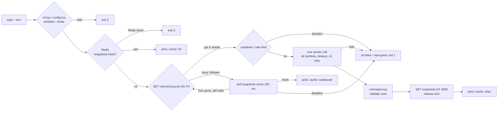

# Architecture

A bounded Lua 5.4 worker that hosts spawn per request. It reads argv and env, talks to Redis and
maybe one market API, prints one JSON object and exits. Decisions and rejected alternatives are
in [adr/](adr/README.md); this page is the summary.

## 1. Process model

- **One-shot CLI** (`lua market.lua fetch BTC,ETH`): one process = one request. The host (Python,
  Go, bash, a K8s Job) owns concurrency, pooling, retries and cancellation; to cancel, it kills us.
  Every run ends within `DEADLINE_MS` (4 s), below the host's kill timeout, so it normally exits on
  its own with a JSON body ([0002](adr/0002-one-shot-cli-worker-with-stdout-contract.md)).
- **Optional daemon** (`lua market.lua daemon`): the same commands as NDJSON on stdin, one
  response per stdout line, handled one at a time. It keeps a Redis connection and a bounded LRU
  between requests. Parallelism still comes from the host running several
  ([0014](adr/0014-daemon-over-stdin-ndjson-with-in-process-lru.md)).
- There is no scheduler, pool or socket server inside Lua.

## 2. Data flow

The leader asks the vendor for **all** requested symbols in one call; followers wait for its
snapshots instead of calling. So 200 parallel identical fetches make **one** vendor call, and the
rest print cached JSON (measured: [LOAD.md](LOAD.md)). Upstream traffic is bounded by
construction: ≤ 1 in-flight call per source (the lock), ≤ 5 calls per 10 s (fixed-window counter),
2 s per call, a `Retry-After` cooldown after a 429
([0008](adr/0008-redis-single-flight-lock-and-snapshots.md), [0012](adr/0012-fixed-window-rate-limit.md),
[0018](adr/0018-upstream-concurrency-cap.md)). Prices stay decimal strings end to end: the vendored
dkjson is patched to keep number text, and `convert` uses arbitrary-precision decimals with one
half-even rounding ([0007](adr/0007-money-as-decimal-strings.md), [0020](adr/0020-convert-output-schema-convert-v1.md)).

## 3. Failure taxonomy

Full table: [0021](adr/0021-failure-taxonomy-and-retry-policy.md).

| Class | What | Handling |
|---|---|---|
| Fatal, caller | bad args, shell metacharacters, amount too long | rejected before any I/O: `BAD_ARGS`, exit 2 |
| Fatal, config | `REDIS_HOST` unset, bad numbers, broken timeout invariant | rejected at startup: `BAD_CONFIG`, exit 2 |
| Retryable with a cap, Redis | connect refused, timeout | ≤ 1 retry, only idempotent commands (never `INCR`, `SET NX`), only if the deadline allows; then `REDIS_UNAVAILABLE`, exit 3 |
| Retryable with a cap, vendor | connect error, 5xx | ≤ 1 retry, only if deadline **and** lock TTL both exceed `SOURCE_TIMEOUT_MS`; then `SOURCE_UNAVAILABLE`, exit 1 |
| Not retried | vendor timeout, 429, cooldown, rate limit | `SOURCE_UNAVAILABLE` / `RATE_LIMITED`, exit 1; a 429 sets the cooldown |
| Poison payload / row | undecodable body; row with a missing field or price ≤ 0 | nothing (or only that row) is cached; `BAD_PAYLOAD`; other rows proceed |
| Recoverable, per symbol | unknown symbol | `errors[]` entry, partial success, exit 0 ([0010](adr/0010-partial-success-semantics.md)) |
| Budget | deadline reached | `DEADLINE_EXCEEDED`, exit 1 |

Every vendor-side failure still prints a full `ticker.v1` body with the last-good items, each
marked `stale` ([0011](adr/0011-vendor-failure-returns-error-with-last-good-data.md)). An
unexpected Lua error prints `INTERNAL_ERROR`, never a stack trace on stdout ([0023](adr/0023-internal-error-code.md)).

## 4. Why stdout, not an HTTP API

The process lifecycle *is* the request lifecycle. The host already knows how to start a process
with a timeout and kill it on cancel; an exit code and one JSON line need no port, no server
hardening, no connection management and no second lifecycle to supervise. Timeouts compose:
`SOURCE_TIMEOUT_MS < LOCK_TTL_MS < DEADLINE_MS < host kill timeout`. Only `src/output.lua` writes
to stdout (a spec fails on any other `print`/`io.write`), so stdout is always parseable; logs are
JSON lines on stderr ([0019](adr/0019-structured-json-logs-on-stderr.md)).

## 5. Memory vs Redis

| In the process | Shared in Redis |
|---|---|
| Daemon only: LRU of normalized tickers, key `{source}:{symbol}`, ≤ 256 entries and ≤ 1 MiB (size = encoded JSON length), least-recently-used evicted first, entries served only while younger than 5 s, an entry bigger than 1 MiB never stored (`src/cache.lua`) | `mkt:lock:{source}` single-flight lock (random token, PX 3000) |
| | `mkt:snapshot:{source}:{symbol}` last-good ticker, EX 3600 |
| | `mkt:rl:{source}:{window}` fixed-window counter, EXPIRE = window |
| | `mkt:cooldown:{source}` after a 429 |
| | `mkt:meta:last_fetch:{source}`, `mkt:stats:vendor_calls:{source}` |

A one-shot process loses all its memory when it exits, so in the normal CLI path the LRU is always
empty and **Redis is the real cache**. The daemon is where in-process memory pays off: a repeat
`snapshot` is answered with `"cache":"memory"` and no Redis round-trip.

**Redis down → fail closed** ([0009](adr/0009-fail-closed-when-redis-unavailable.md)): exit 3,
`REDIS_UNAVAILABLE`. Redis is what stops 1000 workers from calling the vendor at once; serving
"degraded" by calling the vendor without it would turn a Redis outage into a vendor ban. `health`
still prints its full body (Redis `ok:false`) and exits 3. The daemon may still answer `snapshot`
from its LRU, but never calls the vendor without Redis.

**Killed at 5 s mid-fetch.** Nothing is left half-done: the lock simply expires after
`LOCK_TTL_MS` (3 s) and the next invocation becomes leader; each snapshot is one atomic `SET`, so a
symbol has either its old or its new value, each with its own `as_of_unix`; followers keep polling
and take over the lock once it is gone. The vendor-call counter and rate-limit token for that
attempt stay spent, which is correct: the vendor did see the call. In practice the kill rarely
lands mid-fetch, because `DEADLINE_MS` (4 s) makes us finish first.

## 6. Adding a second market source

Write `src/source/<name>.lua` exposing `new(base_url)` → `{ name, fetch(symbols, quote,
timeout_ms) -> rows, errors, info, effective_quote(quote), supports(symbol, quote) }`, where rows
are `{symbol, quote, price, volume_24h, change_24h_pct}` as decimal strings, and add `<name>` to
`M.NAMES` in `src/source/init.lua`. Shared HTTP, status classification (timeout / connect / 5xx /
429 / bad payload), validation, caching, locking and printing are source-independent, so
`ticker.v1` does not change. Binance and Kraken were added exactly this way and are tested with
fixtures served through `SOURCE_URL` ([0006](adr/0006-pluggable-market-sources-coingecko-default.md),
[0024](adr/0024-binance-usd-quote-as-usdt.md)).
